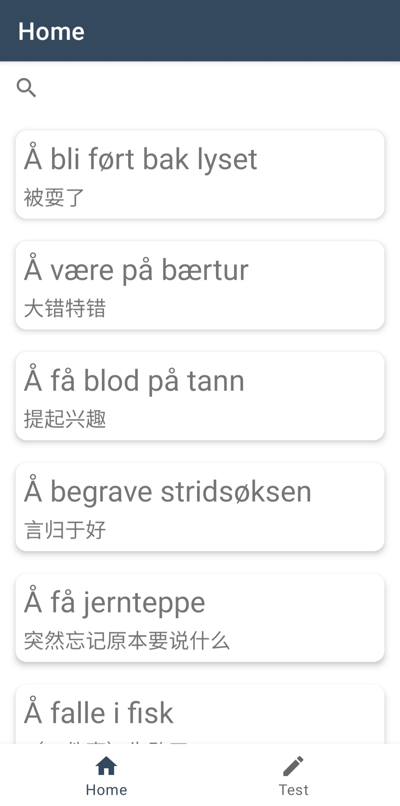
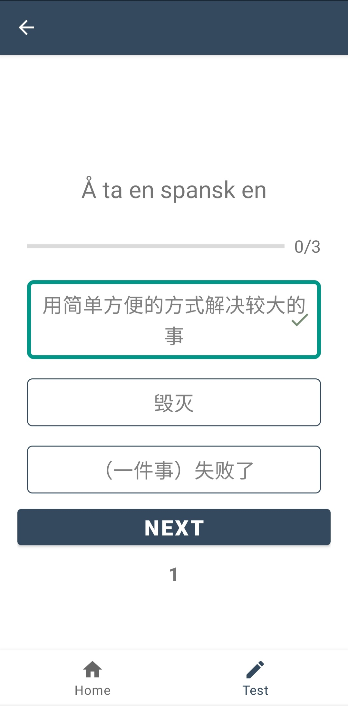

# Norwegian phrases in Chinese

## Project description
This android application holds a collection of Norwegian phrases and idioms, together with their Chinese translations. 
In the future I hope to extend the database with more phrases, and to add a fill-in-blank type of quiz.

## Demonstration of features:
On the front page users can
- scroll down to look at all phrases
- click on the phrases to open up a new page with more explanation
- search for particular phrases by clicking the search-icon

On the quiz page users can:
- take quiz consisting of three randomely picked questions. After all quizes are answered the user sees how many questions he or she answered correctly

## Technologies used:
Database: Firebase Realtime Database

Programming language: kotlin

## To install the application

